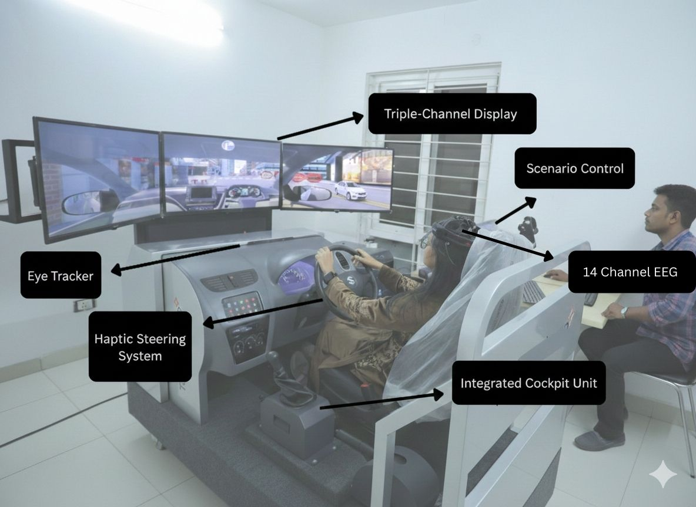

# Welcome to the Driving Cognition Lab
**Decoding Driver Decisions.**

Our lab explores the intersection of human thought and behavior in complex driving environments. We study how drivers process information, manage cognitive load, and make critical decisions to help create a safer future for transportation.

### Our Methodology
We combine psychological theory with advanced technological tools to gain a deep understanding of driver behavior:
* **High-Fidelity Simulation:** Recreating realistic road scenarios in a safe environment.
* **Eye-Tracking:** Mapping visual attention and mental focus during driving tasks.
* **Cognition Research:** Analyzing how distractions and stressors impact performance.

