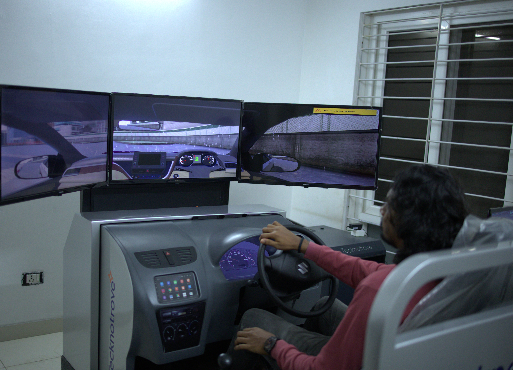
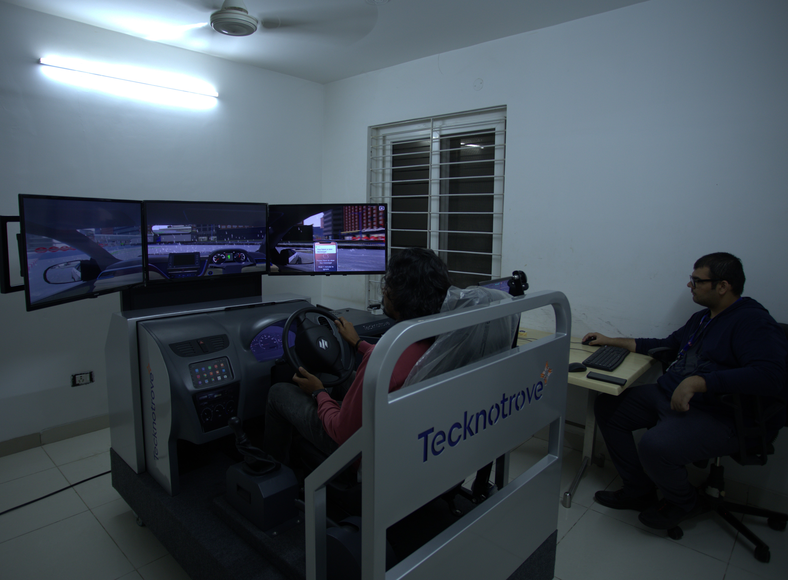

# Our Research

## Project 1: Driving Behaviour and Cognitive Efficiency
**Visual search tasks among young drivers in India.**

This study investigates how young drivers allocate their visual attention during complex search tasks while navigating. Using our simulation environment, we measure cognitive efficiency and gaze patterns to identify high-risk behaviors.

**Leadership Team:**
* **Principal Investigator:** Dr. Sunder Bukya
* **Co-Principal Investigator:** Dr. Nidhi Goyal
* **Co-Principal Investigator:** Dr. Shivaram Male

---

