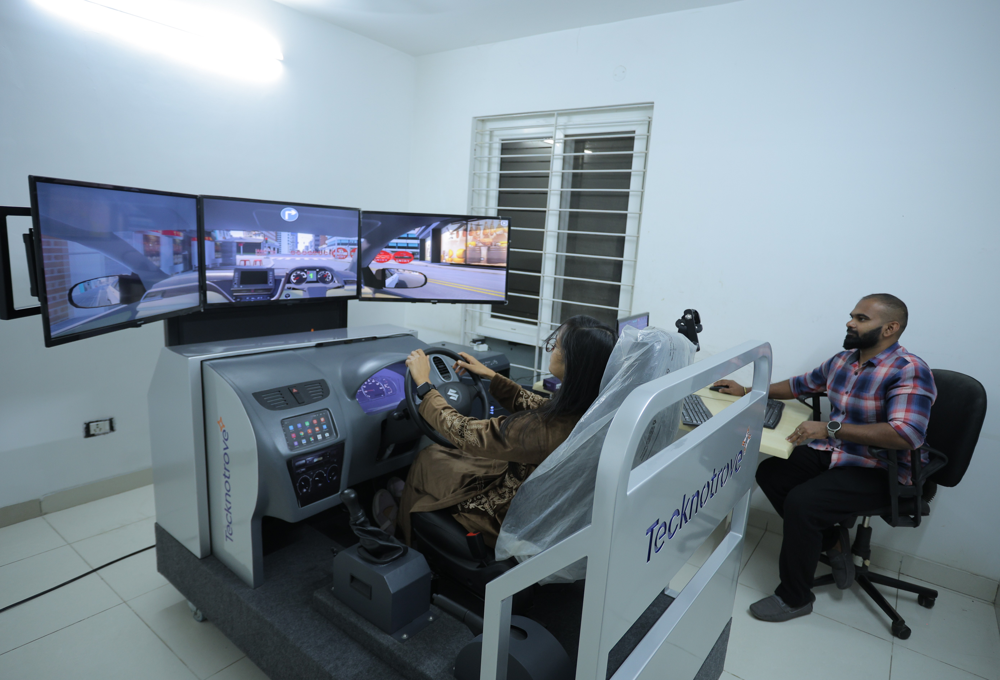
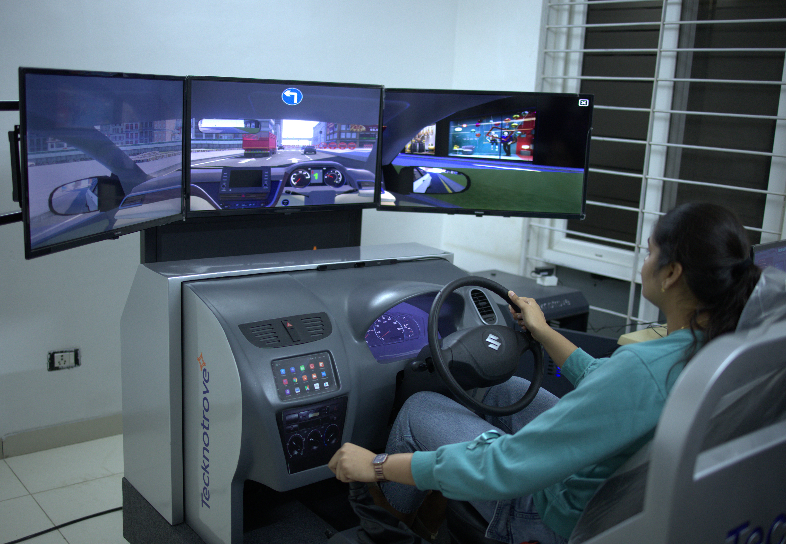

# Our Research

## Project 1: Driving Behaviour and Cognitive Efficiency
**Visual search tasks among young drivers in India.**

This study investigates how young drivers allocate their visual attention during complex search tasks while navigating. Using our simulation environment, we measure cognitive efficiency and gaze patterns to identify high-risk behaviors.

**Leadership Team:**
* **Principal Investigator:** Dr. Sunder Bukya
* **Co-Principal Investigator:** Dr. Nidhi Goyal
* **Co-Principal Investigator:** Dr. Shivaram Male

  

  <h2 style="color: #6a0dad; margin-top: 0;">Project 1: Driving Behaviour and Cognitive Efficiency</h2>
  
<em>Visual search tasks among young drivers in India.</em>

  
  
<strong>PI:</strong> Dr. Sunder Bukya | <strong>Co-PIs:</strong> Dr. Nidhi Goyal, Dr. Shivaram Male

 
---

